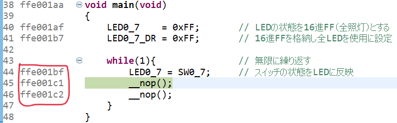

This is a defining difference between **CISC (variable length)** and **RISC (fixed length)** architectures.

# Fixed‑length ISAs (like MIPS, classic ARM)
These architectures use **32‑bit (4‑byte)** instructions, so:

- Every instruction starts at an address that is a **multiple of 4**

- The program counter (PC) always increments by 4

- Instruction boundaries are predictable

```markdown
0x1000  (instruction)
0x1004  (instruction)
0x1008  (instruction)
```
# Variable‑length ISAs (like x86, ARM Thumb, RISC‑V compressed)
Instructions can be 1, 2, 3, … up to 15 bytes (x86 example).

 

This means:

- The next instruction does **NOT** necessarily start at a 4‑byte boundary

- The CPU must **decode the current instruction** to know where the next one begins(the total instruction length can be calculated in the current instruction.)

- The PC increments by the actual instruction length, not a fixed number. **𝑃𝐶 ← 𝑃𝐶 + instruction_length**


It does make the hardware **more complex**:

- The instruction decoder must find instruction boundaries dynamically

- Pipelines need extra logic

- Pre‑decoding and instruction caches become more complicated


This is one reason x86 CPUs are so complex internally.
