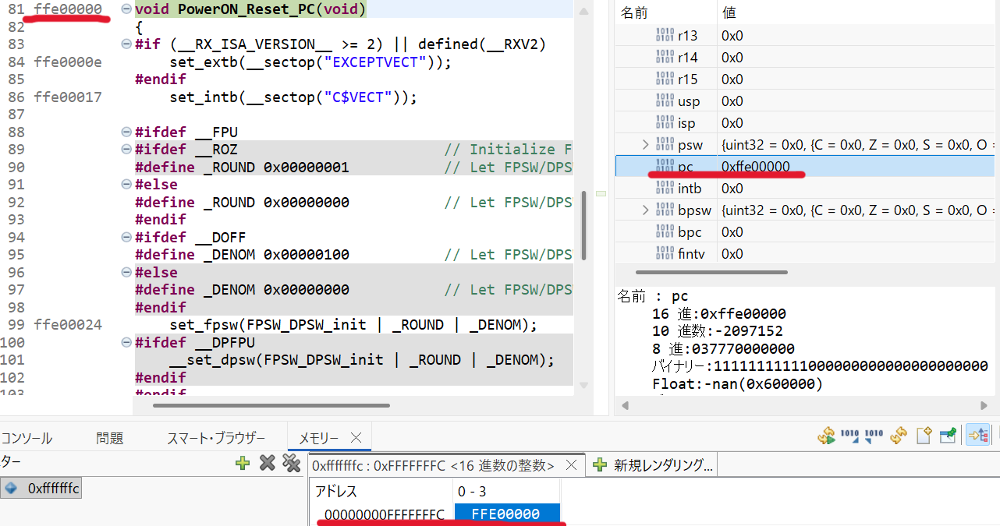

Microcontrollers generally use one of two mechanisms to decide **where the CPU starts executing after reset**:

# Fixed Reset Address (Single, Hard‑wired Address)
Many simple or older MCUs use a fixed, predefined memory address as the reset entry point.

- When reset occurs, the CPU loads the **Program Counter (PC)** with a **hard‑coded address** (eg. `0x00000000`).

- Execution begins directly from that address.

#### Pros
- Simple hardware
- No vector table needed
- Good for small systems

#### Cons
- The reset handler must be placed at that exact address

- Less flexible for bootloaders or multiple firmware images


# Vector Table (Reset Vector Stored in Memory)
More advanced MCUs (ARM Cortex‑M, some 16‑bit/32‑bit MCUs) use a **vector table**.
- After reset, the CPU reads a reset vector from a known table location.

- The table entry contains the **address of the reset handler**.

- The PC is loaded with that address.

For example:



```markdown
the vector table of some MCUs:
RX             :  0xFFFFFFFC  -  0xFFFFFFFF (4 bytes)
RL78           :         0x0  -  0x1 (2 bytes)
ARM(Cortex-M4) :         0x4  -  0x7 (4 bytes)
```

The reset vector of RX MCUs is stored in the address `(0xFFFFFFFC - 0xFFFFFFFF)`.

The PC is loaded with the **address of the reset handler**. 

The address of the reset handler can be changed like this:
```c
//vecttbl.c
#pragma section C RESETVECT
void (*const Reset_Vectors[])(void) = {
//;<<VECTOR DATA START (POWER ON RESET)>>
//;Power On Reset PC
    /*(void*)*/ PowerON_Reset_PC
	//;main
//	/*(void*)*/ main
//;<<VECTOR DATA END (POWER ON RESET)>>
};

#pragma section C RESETVECT
void (*const Reset_Vectors[])(void) = {
//;<<VECTOR DATA START (POWER ON RESET)>>
//;Power On Reset PC
//    /*(void*)*/ PowerON_Reset_PC       //comment out PowerON_Reset_PC
	//;main
	/*(void*)*/ main                       //enable main function
//;<<VECTOR DATA END (POWER ON RESET)>>
};
```
The function name is equal to the **entry address of the function**.

#### Pros
- Very flexible

- Bootloaders can relocate vector tables

- Interrupts and reset share the same mechanism

- Easier to update firmware

#### Cons
- Slightly more complex hardware

- Requires proper vector table setup
